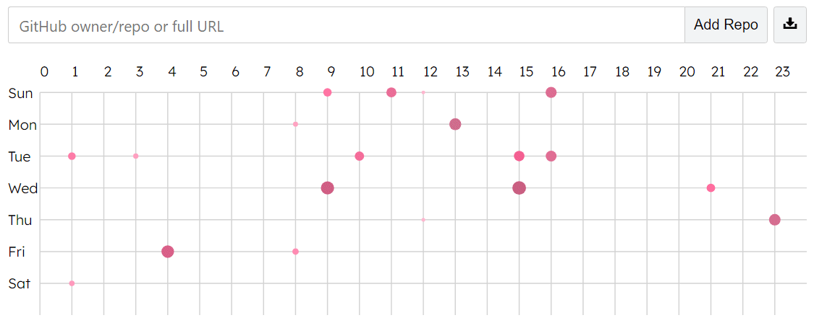

# GitHub PunchCard

[**GitHub PunchCard**](https://punchcard.elebree.com) brings back the classic punch card-style commit visualization once offered by **GitHub**, showing when developers are active across days and hours. Just enter a repository name (e.g. `sveltejs/svelte`) or paste a full GitHub URL. The tool pulls data from GitHub’s public /stats/punch_card API and renders a clean, responsive heatmap.

Built with [Svelte](https://github.com/sveltejs/svelte), using [html2canvas](https://github.com/niklasvh/html2canvas) and [svelte-tags-input](https://github.com/agustinl/svelte-tags-input) under the hood.
